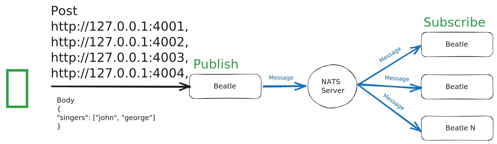

# NATS Node.JS demo

## What is it

It is a proof of concept using NATS as a connective tissue in an event-driven microservice environment.

We have 4 Node.JS RESTful servers called George, John, Paul, and Ringo connected to a NATS server via a NATS client and listening to events that can be triggered for any of them.

