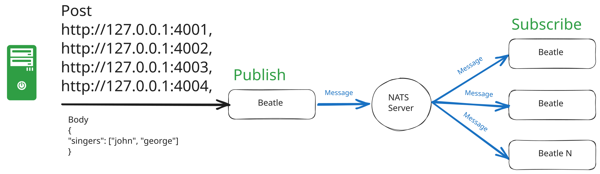

# NATS Node.js demo

A proof of concept for event-driven microservices, using [NATS](https://nats.io) as the message bus.

One Express service runs 4 times, as `george`, `john`, `paul` and `ringo`. All 4 subscribe to the same NATS subject, `beatles`. Send a `POST` request to any of them naming who should sing, and the named services "sing" in their logs:

```
john-1    | {"from":"george","level":"warn","message":["la ♪","la ♩","la ♫","la ♪"],"timestamp":"2026-10-08T15:09:51.673Z","to":["john","george"]}
```



## Before you start

You need:

- Docker with Compose, to run NATS and the services
- Node.js 24 and pnpm 12, only if you want to run a service outside Docker (`.nvmrc` pins the Node version)

Five containers run at once, so give your container runtime enough resources. With [colima](https://github.com/abiosoft/colima) we use `colima start --cpu 4 --memory 8 --disk 10`.

## Run the demo with Docker

1. Build the service image:

   ```sh
   docker compose build
   ```

2. Start NATS and the 4 services:

   ```sh
   docker compose up
   ```

3. Wait until each service logs that it is listening:

   ```
   george-1  | {"level":"info","message":"server listening 📡 {\"SERVICE_NAME\":\"george\",\"PORT\":4001}","timestamp":"..."}
   ```

Each service listens on `127.0.0.1` on its own port:

| Service  | Port |
| -------- | ---- |
| `george` | 4001 |
| `john`   | 4002 |
| `paul`   | 4003 |
| `ringo`  | 4004 |

## Make the services sing

Send a `POST` request to any service with a `singers` array. Use any of the 4 names, in any order.

```sh
curl 127.0.0.1:4001 \
  --header 'Content-Type: application/json' \
  --data '{"singers": ["john", "george"]}'
```

The service you called replies straight away:

```json
{ "message": "people singing: john, george" }
```

Then every service named in `singers` logs a line like this, whether or not it is the one you called:

```
john-1    | {"from":"george","level":"warn","message":["la ♪","la ♩","la ♫","la ♪"],"timestamp":"...","to":["john","george"]}
george-1  | {"from":"george","level":"warn","message":["la ♪","la ♩","la ♫","la ♪"],"timestamp":"...","to":["john","george"]}
```

To publish from a different service, change the port. This asks `john` to make `paul` and `ringo` sing:

```sh
curl 127.0.0.1:4002 \
  --header 'Content-Type: application/json' \
  --data '{"singers": ["paul", "ringo"]}'
```

### If the request is wrong

The service replies with status 400 and says what to fix. For example, `{"singers": ["yoko"]}` gets:

```json
{ "errors": ["\"singers[0]\" must be one of [george, john, paul, ringo]"] }
```

## Run a service outside Docker

Useful when you want to change the code and restart quickly.

1. Install dependencies:

   ```sh
   pnpm install
   ```

2. Start NATS on its own. This Compose file also turns on NATS debug and trace output:

   ```sh
   docker compose -f docker-compose-development.yml up
   ```

3. In another terminal, start a service by name:

   ```sh
   pnpm start:george
   ```

   The same works for `start:john`, `start:paul` and `start:ringo`. Each script sets `SERVICE_NAME` and `PORT`. You can set them yourself instead:

   ```sh
   SERVICE_NAME=george PORT=4001 pnpm --filter service start
   ```

4. Lint, format and type-check from the repo root:

   ```sh
   pnpm lint        # Biome: lint rules, formatting and import order
   pnpm format      # Biome: rewrite files in place
   pnpm typecheck   # tsc --noEmit
   ```

Node 24 runs the TypeScript source directly by stripping the types, so there is no build step.

## How it works

There is one service, in `projects/service`. Its name and port come from the environment, and Docker Compose starts the same image 4 times with different values.

| Variable          | Required | Default        | What it does                                                                      |
| ----------------- | -------- | -------------- | --------------------------------------------------------------------------------- |
| `SERVICE_NAME`    | Yes      |                | One of `george`, `john`, `paul`, `ringo`. The service refuses to start otherwise. |
| `PORT`            | No       | `4000`         | HTTP port to listen on.                                                           |
| `NATS_SERVER_URL` | No       | `0.0.0.0:4222` | NATS server address. Compose sets it to `nats:4222`.                              |

On start-up the service connects to NATS and subscribes to the `beatles` subject. Every message on that subject is a JSON object with `from` and `to`. The service sings only if its own name is in `to` (see [`projects/service/nats.ts`](projects/service/nats.ts)):

```ts
for await (const message of beatlesSubscription) {
  const { from, to } = message.json<BeatlesMessage>();

  if (to.includes(SERVICE_NAME)) {
    logger.warn({ from, message: ['la ♪', 'la ♩', 'la ♫', 'la ♪'], to });
  }
}
```

A `POST /` request validates the body with Joi, then publishes it (see [`projects/service/routes.ts`](projects/service/routes.ts)):

```ts
natsClient.publish('beatles', JSON.stringify({ from: SERVICE_NAME, to: singers }));
```

NATS delivers the message to every subscriber, including the publisher. That is why a service can make itself sing.

## Repo layout

- `projects/service/` – the Express service ([readme](projects/service/readme.md))
- `Dockerfile` – builds the service image
- `docker-compose.yml` – NATS plus 4 copies of the service
- `docker-compose-development.yml` – NATS only, for local development
- `docs/` – background reading and the diagram

## Read more

- [What NATS is and when to use it](docs/nats.md)
- [Try NATS from the command line](docs/cli-demo.md)
