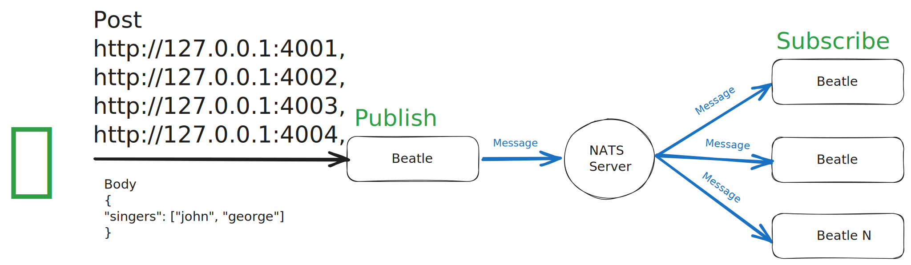

# NATS Node.JS demo

## What is it

It is a proof of concept using NATS as a connective tissue in an event-driven microservice environment.

We have 4 Node.JS RESTful servers called `george`, `john`, `paul`, and `ringo` connected to a NATS server via a NATS client and listening to events that any can trigger.

The idea is that each of them can publish a message to announce who/whom will "sing" via an array of strings with the name of the services.

If a service is subscribed to the message, it will "sing" as a server log with

```sh
nats-node-demo-george-1  | {"from":"george","level":"warn","message":["la ♪","la ♩","la ♫","la ♪"],"timestamp":"2023-05-29T09:36:26.470Z","to":["john","george"]}
```



## How to run

The five services, a NATS server and 4 Node.JS/Express servers, can be built and run using `docker compose`.

Because of the number of services running, we suggest increasing resources in your container runtime. For example, we develop this using [`colima`](https://github.com/abiosoft/colima), and we initiate the runtime with `colima start --cpu 4 --memory 8 --disk 10`

- Build services

```sh
docker compose build
```

- Run services

```sh
docker compose up
```

- Once services are up and running, you can find server logs for the4 Node.JS/Express server

```sh
nats-node-demo-paul-1    | {"level":"info","message":"server listening 📡 {\"HOST\":\"127.0.0.1\",\"PORT\":\"4003\"}","timestamp":"2023-05-29T09:09:52.911Z"}
nats-node-demo-ringo-1   | {"level":"info","message":"server listening 📡 {\"HOST\":\"127.0.0.1\",\"PORT\":\"4004\"}","timestamp":"2023-05-29T09:09:53.149Z"}
nats-node-demo-john-1    | {"level":"info","message":"server listening 📡 {\"HOST\":\"127.0.0.1\",\"PORT\":\"4002\"}","timestamp":"2023-05-29T09:09:53.164Z"}
nats-node-demo-george-1  | {"level":"info","message":"server listening 📡 {\"HOST\":\"127.0.0.1\",\"PORT\":\"4001\"}","timestamp":"2023-05-29T09:09:53.179Z"}
```

- All of them are running in `localhost` (127.0.0.1) but in different ports

| Service name | Port |
| ------------ | ---- |
| `george`     | 4001 |
| `john`       | 4002 |
| `paul`       | 4003 |
| `ringo`      | 4004 |

- Send `POST` request to one of them with a payload like this. You can add or remove service names from the payload array to make more or fewer services "sing."

```json
{
  "singers": ["john"]
}
```

```json
{
  "singers": ["john", "paul", "george", "ringo"]
}
```

```sh
curl --location '127.0.0.1:4001' \
--header 'Content-Type: application/json' \
--data '{
    "singers": ["john", "george"]
}'
```

- You will receive a response like this

```json
{
  "message": "people singing: john, george"
}
```

- Check the server logs, and you will see the services "sing" like this

```sh
nats-node-demo-john-1    | {"from":"george","level":"warn","message":["la ♪","la ♩","la ♫","la ♪"],"timestamp":"2023-05-29T09:43:36.179Z","to":["john","george"]}
nats-node-demo-george-1  | {"from":"george","level":"warn","message":["la ♪","la ♩","la ♫","la ♪"],"timestamp":"2023-05-29T09:43:36.181Z","to":["john","george"]}
```

- You can send `POST` requests to any of them just by changing the port number

```sh
# Via george
curl --location '127.0.0.1:4001' \
--header 'Content-Type: application/json' \
--data '{
    "singers": ["john", "ringo", "paul"]
}'
```

```sh
# Via john
curl --location '127.0.0.1:4001' \
--header 'Content-Type: application/json' \
--data '{
    "singers": ["john", "george"]
}'
```

## How to develop

This repo is configured as a monorepo managing packages and dependencies with `pnpm` [workspaces](https://pnpm.io/workspaces)

- First, you need to install dependencies

```sh
pnpm i
```

- In a terminal tab, you can run the NATS server using `docker compose`

```sh
 docker compose -f ./docker-compose-development.yml up
```

### Node.js / Express servers

Each server is under the folder `projects` and is sharing packages by the `shared` NPM package.

From the root of the monorepo you can initiate every service (4 of them) by running in each terminal tab `pnpm --filter "<NAME OF THE SERVICE>" start`

```sh
pnpm --filter "george" start
```

Each server connects to the NATS server using a JavaScript NATS client.

```ts
import dotenv from 'dotenv';
import { connect, StringCodec, Subscription } from 'nats';

dotenv.config();

const natsServerAddress = process.env.NATS_SERVER_URL || '0.0.0.0:4222';

export const natsClient = await connect({ servers: natsServerAddress });
```

Each server subscribes to a subject

```ts
export const beatlesSubscription = natsClient.subscribe('beatles');
```

And "sing" as a server log if a message from the subject subscribed has its service name

```ts
export const singIfReceiveMessage = async () => {
  const fileContents = await readFile('./package.json', { encoding: 'utf-8' });
  // Get the name of the service
  const { name } = JSON.parse(fileContents);

  // Loop from all the messages from the topic subscribed
  for await (const message of beatlesSubscription) {
    const { from, to }: BeatlesMessage = JSON.parse(
      // decode binary to string from message data
      stringCodec.decode(message.data),
    );

    // Evaluates message has the service name
    const shouldSing = to.includes(name);
    if (shouldSing) {
      // Sing as a server log
      logger.warn({
        from,
        message: ['la ♪', 'la ♩', 'la ♫', 'la ♪'],
        to,
      });
    }
  }
};
```

Each server can receive `POST` requests to publish a message to the NATS server.

```sh
# Via george
curl --location '127.0.0.1:4001' \
--header 'Content-Type: application/json' \
--data '{
    "singers": ["john", "ringo", "paul"]
}'
```
